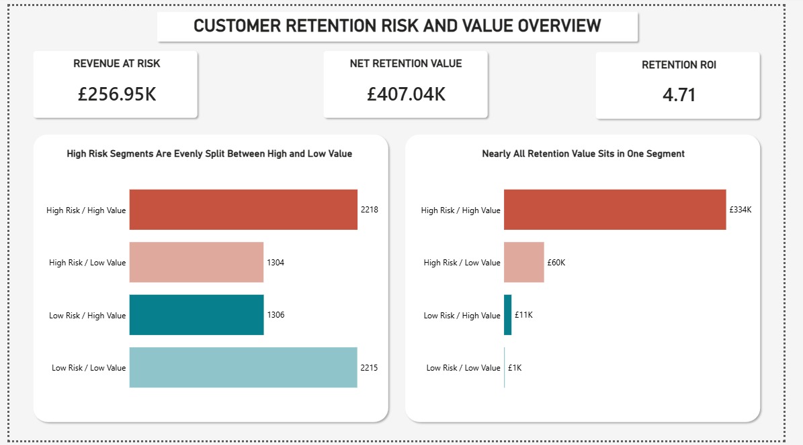
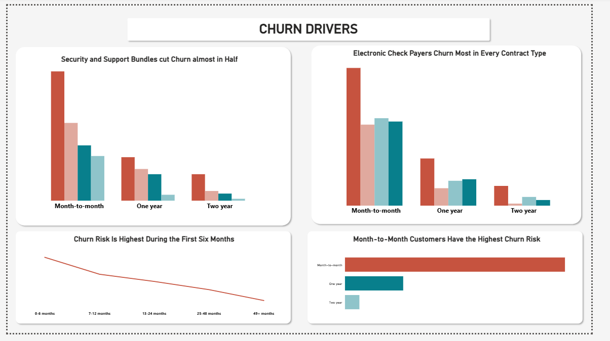
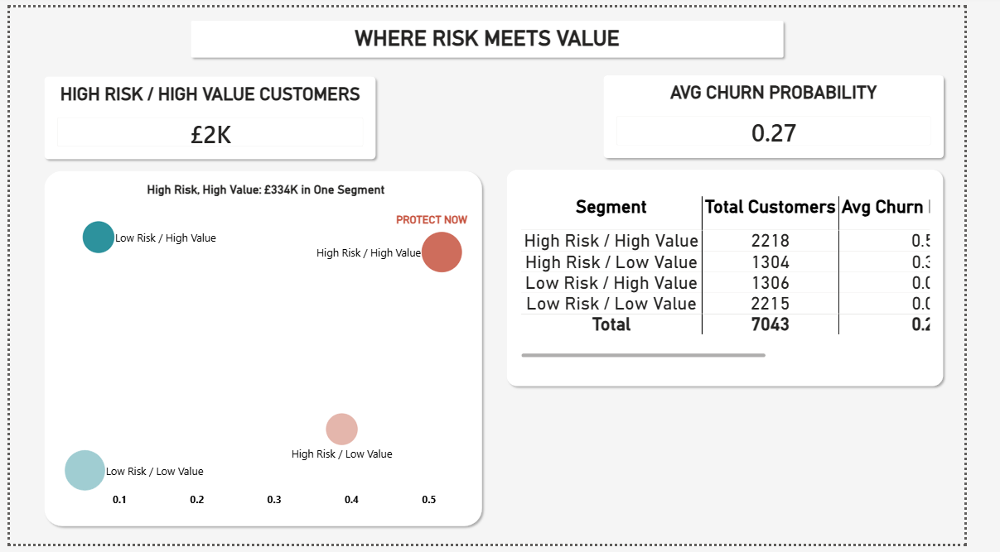
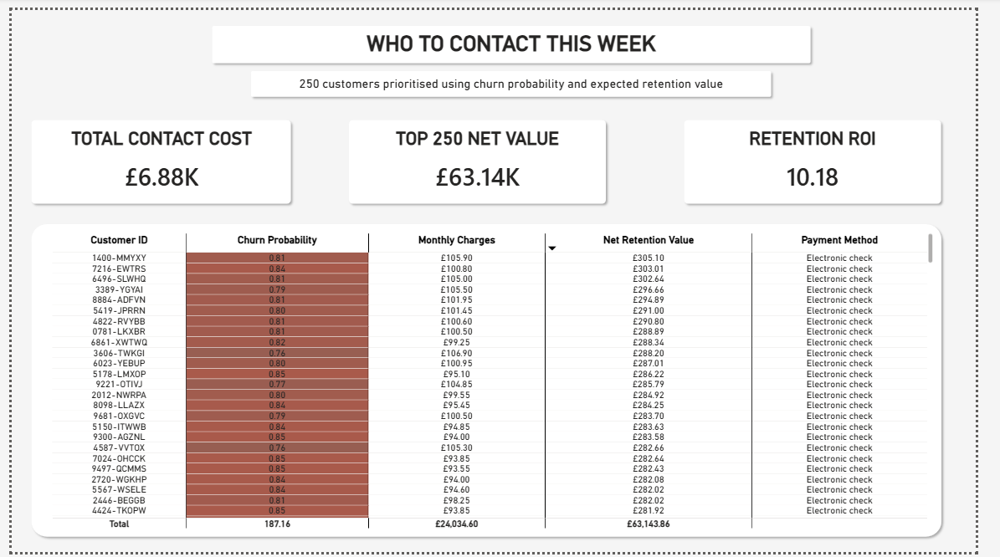

# Customer Churn Risk & Retention Economics

This is a project I built to answer a question that goes beyond "who is going to churn." That question on its own isn't that useful to a business. What actually matters is who should we spend money trying to keep, what should we actually do to keep them, and how would we know afterwards if it worked. That's the question I set out to answer here, using a real dataset, real SQL work, a real model, and a Power BI report built on top of all of it.

**Data:** [IBM Telco Customer Churn](https://www.kaggle.com/datasets/blastchar/telco-customer-churn) — around 7,000 real, anonymised telecom customers, with a genuine churn outcome recorded for each one. I picked this specifically because I wanted the underlying customer data to be real, rather than something I generated myself. It's a snapshot rather than a live feed, but no real customer data updates live in public anywhere, for obvious reasons, so a snapshot is as real as this kind of project gets.

## Report
EXECUTIVE SUMMARY

CHURN DRIVERS

RISK & VALUE

INTERVENTION RECOMMENDATIONS

Interactive report available as a downloadable `.pbix` file (see main) — Power BI's public web-publishing feature isn't available on my current account.

## Why I built it this way

I picked Logistic Regression deliberately, tested properly against Random Forest rather than assumed to be the right choice. It's a genuinely different technique from the tree-based models I usually reach for, which mattered to me going in. The actual weight of this project sits elsewhere though, in the SQL work that found the real drivers of churn before any model got touched, and the economics on the back end that turn a risk score into an actual business decision.

Two people would use something like this in a real company, and they don't automatically agree with each other. A Retention Manager wants to know who to call. A Finance lead wants to know if calling them is actually worth the money. Most of what I built exists to answer both of those at once, not just the first one.

## What's actually in here

**SQL layer (BigQuery)**
I started by looking at retention and cohorts before touching anything predictive. Since this dataset has no signup date, I used tenure (how long someone's been a customer) as a stand in for cohort age, which is the normal way to work with this specific dataset. That gave me a real retention curve, and it's steep. Customers in their first 6 months churn at 52.9%. Customers past 4 years churn at 9.5%. That gap alone told me where to look next.

From there I went driver hunting properly, not just eyeballing correlations. Three things held up when I controlled for other variables:

- **Contract type.** Month to month customers churn at 42.7%. Two year contract customers churn at 2.8%. That's over 15 times the difference, and it's the single strongest thing in the whole dataset.
- **Add on services** (online security and tech support). Within month to month customers only, so contract type isn't muddying it, churn drops from 54.7% with neither service to 23.4% with both. I checked this a second time controlling for internet service type instead of contract type, and it held up there too.
- **Payment method**, specifically electronic check. It's the worst performing payment method inside every single contract tier, not just on average. That repetition across three separate groups is what convinced me it's real and not a fluke of one slice of the data.

**Predictive model (Python, scikit-learn)**
Logistic Regression against Random Forest, split by tenure so the model trains on longer standing customers and gets tested on newer ones, which is the closest thing to a real time based split this dataset allows for. I wrote the decision rule down before running either model: if the performance gap is small, go with the more explainable one. Logistic Regression ended up winning outright anyway, ROC-AUC of 0.760 against 0.735 for Random Forest, and 83.3% precision in the top 20% of customers by predicted risk against 79.4%. The simpler, more explainable model won on the numbers, on its own merits, not as a fallback.

I'll be honest about a bug I hit here because it's worth knowing about. My first version of the train and test split looked fine, ran with no errors, gave believable looking numbers. But the model's precision in its top 20% came out at 8.5%, worse than picking customers at random, which makes no sense for a model that's supposed to be ranking risk. Turned out I'd reset the row index after sorting by tenure, which quietly broke the lookup that pulled the actual sorted rows, so the "time ordered" split was really just an arbitrary slice of the data in whatever order BigQuery happened to return it. Fixed it, reran it, got the real numbers above. A number that didn't make sense is what caught it, not a crash or an error message.

**Segmentation and economics**
Every customer gets scored, then split into four groups by risk and value: High or Low risk against High or Low monthly revenue. The one that matters most is High Risk / High Value: 2,218 customers, £197,836.70 in monthly revenue between them, and 51.2% of them actually do churn, which lines up almost exactly with what the model predicted for that group (51.7%). That match is encouraging, it suggests the model's probabilities are reasonably well-calibrated at the segment level, though this comparison used the same data the model was scored on, so it's worth treating as a promising sign rather than independent proof.

Then I built the actual money question. Cost to contact a customer, £27.50. Chance that contacting them actually works, 32.5%. Value of keeping them, 12 months of their monthly charge. These are stated assumptions, not measured figures, and I say so plainly rather than pretending otherwise. Simple breakeven math said to contact almost everyone, which isn't useful since no retention team can actually call 90% of a customer base. So I built a second view ranking customers by expected net value instead, and capped it at a realistic number a team could actually work through. Top 250 customers by that ranking came out 100% from the High Risk / High Value segment, with an expected net value of £63,144. I ran the cost and success rate assumptions across a low, base, and high scenario too, and while the exact pound figure moves by around £100k across that range, which segment matters most doesn't move at all.

**Measurement plan**
No campaign has actually run, so this is a design for how you'd check the results properly once one does, rather than a report of real outcomes. The short version: hold back a control group from the same pool of qualifying customers, don't contact them even though they'd otherwise get called, then compare churn between the group that got contacted and the group that didn't after 90 days. Comparing contacted customers to the whole customer base would be the wrong comparison, since they were already the riskiest people to begin with.

**Power BI report**
Four pages. An overview with the headline numbers, the three drivers laid out with evidence behind each one, the risk and value segmentation, and the actual working list, ranked, of who to contact this week and what it's worth.

## What I'd tell someone asking about the weak points

The 12 month retention horizon I used in the economics is the single most influential assumption in the whole thing, and it's the one I tested the least. The cost and success rate ranges got a proper sensitivity check, the horizon didn't.

The model and the SQL analysis mostly agree with each other but not perfectly, and I dug into where they disagreed rather than smoothing it over. The add on services driver didn't show up in the model's top 10 coefficients at first, which worried me, so I widened the printout instead of assuming something was wrong with the SQL work. Both add on variables had real, correctly signed coefficients the whole time, just further down the list than I'd originally printed.

This is a proof of concept. The churn definition, the intervention cost, the success rate, all of it would need validating against a real campaign before anyone should act on the exact numbers. What I'm confident stands up is the method, and the honesty about what's assumption versus what's actually measured.
